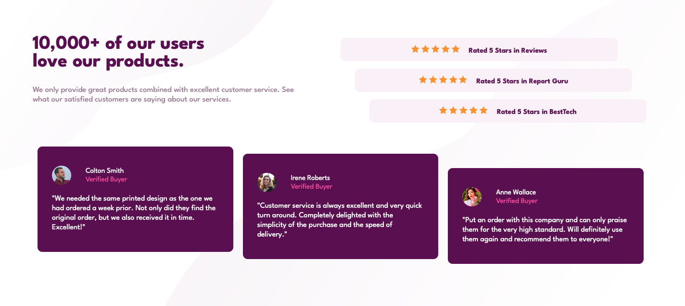

# Frontend Mentor - Social proof section solution

This is a solution to the [Social proof section challenge on Frontend Mentor](https://www.frontendmentor.io/challenges/social-proof-section-6e0qTv_bA). Frontend Mentor challenges help you improve your coding skills by building realistic projects. 

## Table of contents

- [Overview](#overview)
  - [The challenge](#the-challenge)
  - [Screenshot](#screenshot)
  - [Links](#links)
- [My process](#my-process)
  - [Built with](#built-with)
  - [What I learned](#what-i-learned)
  - [Continued development](#continued-development)
  - [Useful resources](#useful-resources)
- [Author](#author)
- [Acknowledgments](#acknowledgments)

## Overview

### The challenge

Users should be able to:

- View the optimal layout for the section depending on their device's screen size

### Screenshot

### Links

- Solution URL: https://samanthascarcella.github.io/Social-proof-section-master/
- Live Site URL: https://samanthascarcella.github.io/Social-proof-section-master/

## My process

### Built with

- Semantic HTML5 markup
- CSS custom properties
- Flexbox
- Mobile-first workflow

### What I learned

- Layering flexboxes and altering directions as necessary.

### Continued development

This project is complete. Minor changes may be made to the design (e.g., margin, padding, etc.).

### Useful resources

- MDN (https://developer.mozilla.org/en-US/)

## Author

- Website - [Samantha Scarcella](https://github.com/samanthascarcella)
- Frontend Mentor - [@samanthascarcella](https://www.frontendmentor.io/profile/yourusername)

## Acknowledgments

I would like to acknowledge the Frontend Mentor and Codepen communities for creating opportunities for other developers learn and grow. 
